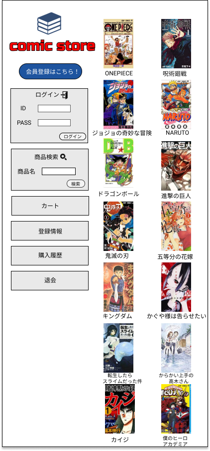

### 画面詳細
## トップページ
### プロトタイプは以下のリンク先
[プロトタイプ](https://www.figma.com/file/1qrEKi7iktAY3U27hFIezf/Untitled?node-id=0%3A1)
*****

*****

| ID | 要素 | 内容 | アクション | イベント | 対応DB |
|----|------|------|-----------|----------|--------|
|1 |バナー|サイト名表示|- |- |- |
|2 |ログイン|テキスト画像|- |- |- |
|3 |ID|入力欄|テキスト入力※英数字|- |〇 |
|4 |PASS|入力欄|テキスト入力※英数字|- |〇 |
|5 |ログインボタンボタン|クリック|ログイン処理実行|- |- |
|6 |商品検索|テキスト画像|- |- |- |
|7 |商品名|テキスト表示|- |- |- |
|8 |商品名|入力欄|テキスト入力※英文字・日文字|- |- |
|9 |マンガ|テキスト表示|- |- |- |
|10 |マンガ|チェックボックス|選択|- |〇 |
|11 |検索 |ボタン|クリック |検索処理実行|〇 |
|12 |商品一覧|画像ボタン|クリック|商品一覧へ遷移|〇|
|13 |カートの中|画像ボタン|クリック|カートの中へ遷移|〇|
|14 |登録情報|画像ボタン|クリック|登録情報へ遷移|〇|
|15 |商品一覧|テキスト表示|- |- |- |
|16 |商品画像|画像リンク|クリック|商品詳細への遷移|〇|
|17 |商品名|テキストリンク|クリック|商品詳細への遷移|〇|
|18 |価格|テキスト表示|- |- |〇 |
|19 |購入履歴|テキスト表示|- |- |〇 |
|20 |退会 |クリック|退会処理 |- |- |
