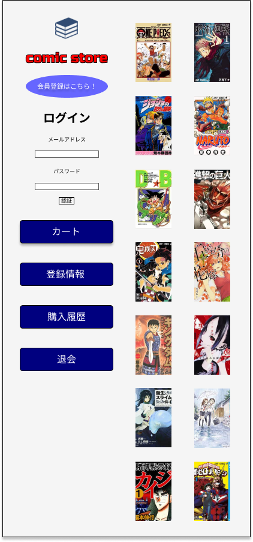

### 画面詳細
## ログイン
### プロトタイプは以下のリンク先
[プロトタイプ](https://www.figma.com/file/1qrEKi7iktAY3U27hFIezf/Untitled?node-id=0%3A1)
*****

*****

| ID | 要素 | 内容 | アクション | イベント | 対応DB |
|----|------|------|-----------|----------|--------|
|1 |メールアドレス|入力欄|テキスト入力※英数字|- |〇 |
|2 |PASS|入力欄|テキスト入力※英数字|-     |〇 |
|3 |ログインボタンボタン|クリック|ログイン処理実行|- |〇|
|4 |失敗|テキスト表示|-         |-         |-      |
