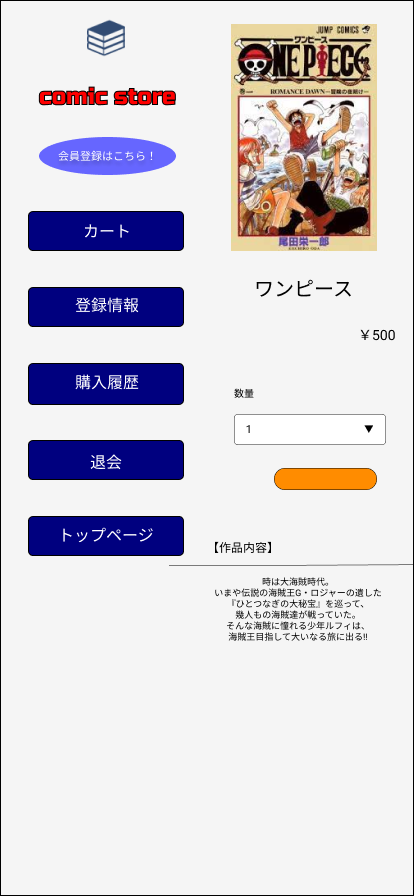

### 画面詳細
## 商品詳細
### プロトタイプは以下のリンク先
[プロトタイプ](https://www.figma.com/file/1qrEKi7iktAY3U27hFIezf/Untitled?node-id=0%3A1)
*****

*****

| ID | 要素 | 内容 | アクション | イベント | 対応DB |
|----|------|------|-----------|----------|--------|
|1   |バナー|サイト名表示|-     |-         |-      |
|2   |マンガ|テキスト表示|- |- |- |
|3   |マンガ|チェックボックス|選択|-       |〇      |
|4   |商品内容|テキスト表示|-    |-        |-        |
|5   |巻数変更|クリック|巻数変更 |-        |〇       |
|6   |カートに入れる|クリック|商品をカート内へ遷移|〇|
|7   |トップページ|画像ボタン|クリック|商品一覧へ遷移|〇|
|8   |カート|画像ボタン|クリック|カートの中へ遷移|〇|
|9   |登録情報|画像ボタン|クリック|登録情報へ遷移|〇|
|10  |商品画像|画像リンク|クリック|商品詳細への遷移|〇|
|11  |商品名|テキストリンク|クリック|商品詳細への遷移|〇|
|12  |価格|テキスト表示|-      |-          |〇      |
|13  |購入履歴|テキスト表示|-  |-          |〇      |
|14  |退会 |クリック|退会処理  |-          |-       |
