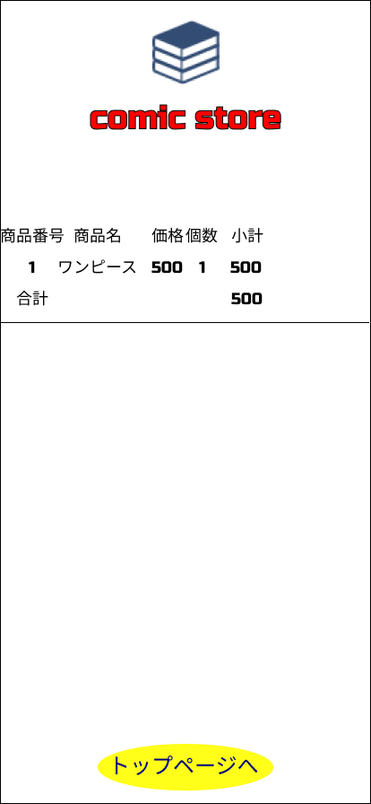

### 画面詳細
## 購入履歴
### プロトタイプは以下のリンク先
[プロトタイプ](https://www.figma.com/file/1qrEKi7iktAY3U27hFIezf/Untitled?node-id=0%3A1)
*****

*****

| ID | 要素 | 内容 | アクション | イベント | 対応DB |
|----|------|------|-----------|----------|--------|
|1   |商品番号|番号表示|-       |-         |〇     |
|2   |商品名|商品名表示|-       |-         |〇     |
|3   |価格  |価格表示|-         |-         |〇     |
|4   |個数  |購入個数表示|-     |-         |〇     |
|5   |小計  |小計表示|-         |-         |〇     |
|6   |合計  |購入した商品の合計が鵜を表示|- |- |〇 |
|7   |トップページ|トップページに戻る|クリック|- |- |
